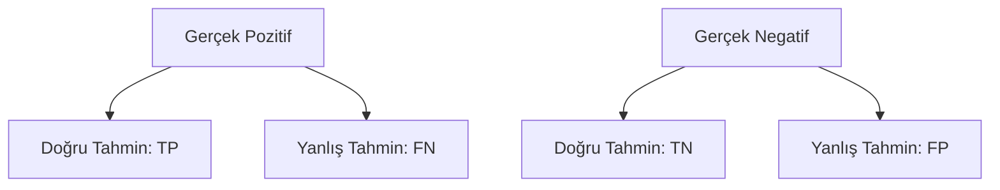

# 📊 Kesinlik (Precision), Duyarlılık (Recall) ve F1-Score

## 📌 Genel Bakış
Sınıflandırma problemlerinde doğruluğun (accuracy) yetersiz kaldığı durumlarda model performansını anlamlandırmak için üç temel metriğe başvurulur: **Kesinlik (Precision)**, **Duyarlılık (Recall)** ve her ikisini dengeleyen **F1-Score**. Bu dokümanda, bu metriklerin matematiksel formülleri, aralarındaki ödünleşim (trade-off) ve ROC-AUC ile PR-AUC eğrilerinin kullanım senaryoları açıklanmaktadır.

---

## 🔬 Matematiksel Formülasyon



### 1. Kesinlik (Precision)
Modelin **Pozitif** olarak sınıflandırdığı örneklerin ne kadarının gerçekten pozitif olduğunu ölçer. Formülü:

$$\text{Kesinlik (Precision)} = \frac{TP}{TP + FP}$$

*   **Öncelikli Kullanım:** False Positive (Yanlış Pozitif) maliyetinin çok yüksek olduğu durumlar.
*   *Örnek:* E-posta spam filtresi. Eğer normal (spam olmayan) bir e-posta spam olarak işaretlenirse (FP), kullanıcı önemli bir iş e-postasını kaçırabilir. Bu yüzden kesinliğin yüksek olması istenir.

### 2. Duyarlılık (Recall / Sensitivity)
Gerçekte **Pozitif** olan örneklerin ne kadarının model tarafından yakalanabildiğini ölçer. Formülü:

$$\text{Duyarlılık (Recall)} = \frac{TP}{TP + FN}$$

*   **Öncelikli Kullanım:** False Negative (Yanlış Negatif) maliyetinin hayati olduğu durumlar.
*   *Örnek:* COVID-19 testi veya kanser taraması. Hasta bir kişiye "sağlıklı" teşhisi konulursa (FN), tedavi gecikebilir ve bu hayati risk yaratır. Bu yüzden duyarlılığın yüksek olması istenir.

### 3. F1-Score
Precision ve Recall değerlerinin harmonik ortalamasıdır. Aritmetik ortalama yerine harmonik ortalamanın seçilmesinin nedeni, uç durumlarda (örneğin Precision=1, Recall=0 olduğunda aritmetik ortalamanın %50 vermesi ancak F1'in doğru şekilde 0 vermesi) cezalandırıcı olmasıdır. Formülü:

$$\text{F1-Score} = 2 \times \frac{\text{Precision} \times \text{Recall}}{\text{Precision} + \text{Recall}} = \frac{2TP}{2TP + FP + FN}$$

### 4. F-Beta Skoru ($F_\beta$)
Eğer Precision veya Recall'a iş ihtiyacına göre daha fazla ağırlık verilmek istenirse $F_\beta$ skoru kullanılır:

$$F_\beta = (1 + \beta^2) \times \frac{\text{Precision} \times \text{Recall}}{(\beta^2 \times \text{Precision}) + \text{Recall}}$$

*   **$\beta = 0.5$:** Precision'a Recall'dan iki kat daha fazla ağırlık verir (FP azaltılmak istenir).
*   **$\beta = 2.0$:** Recall'a Precision'dan iki kat daha fazla ağırlık verir (FN azaltılmak istenir).

---

## 📈 Eğriler Altındaki Alan: ROC-AUC vs. PR-AUC

Sadece sabit bir eşik değerine (threshold) göre ölçülen tekil metrikler yerine, modelin tüm eşik değerlerindeki performansını görmek için eğriler kullanılır:

### 1. ROC Eğrisi (Receiver Operating Characteristic) & AUC
*   **Eksenler:** Y-ekseni: Duyarlılık (True Positive Rate - TPR), X-ekseni: False Positive Rate (FPR = $FP / (TN + FP)$).
*   **Ne Zaman Kullanılır?** Sınıflar dengeli olduğunda veya her iki sınıfın da performansı eşit derecede önemli olduğunda.

### 2. PR Eğrisi (Precision-Recall) & AUC
*   **Eksenler:** Y-ekseni: Kesinlik (Precision), X-ekseni: Duyarlılık (Recall).
*   **Ne Zaman Kullanılır?** Veri setinde **ağır dengesizlik (imbalance)** olduğunda. ROC eğrisi, negatif sınıfların çok fazla olmasından dolayı yanıltıcı bir şekilde iyimser sonuç gösterebilir. PR eğrisi ise doğrudan azınlık sınıfı hedef alır ve gerçeği yansıtır.

---

## 💻 Python ve Scikit-Learn ile Uygulama

Aşağıdaki scriptte sentetik dengesiz veri kümesi üzerinde tüm bu metriklerin hesaplanması ve ROC / PR eğrilerinin nasıl çizdirileceği gösterilmiştir:

```python
import numpy as np
import matplotlib.pyplot as plt
from sklearn.datasets import make_classification
from sklearn.model_selection import train_test_split
from sklearn.linear_model import LogisticRegression
from sklearn.metrics import (
    precision_score, recall_score, f1_score, fbeta_score,
    roc_curve, auc, precision_recall_curve
)

# 1. Dengesiz veri seti oluşturma (%90 negatif, %10 pozitif sınıf)
X, y = make_classification(
    n_samples=5000, n_classes=2, weights=[0.9, 0.1], random_state=42
)
X_train, X_test, y_train, y_test = train_test_split(X, y, test_size=0.3, random_state=42)

# 2. Model Eğitimi ve Olasılık Tahminleri
model = LogisticRegression()
model.fit(X_train, y_train)
y_probs = model.predict_proba(X_test)[:, 1] # Pozitif sınıfa ait olasılıklar
y_pred = model.predict(X_test)

# 3. Metriklerin Hesaplanması (Standart 0.5 eşiği)
precision = precision_score(y_test, y_pred)
recall = recall_score(y_test, y_pred)
f1 = f1_score(y_test, y_pred)
f05 = fbeta_score(y_test, y_pred, beta=0.5)

print(f"Kesinlik (Precision): {precision:.4f}")
print(f"Duyarlılık (Recall)  : {recall:.4f}")
print(f"F1-Score            : {f1:.4f}")
print(f"F(0.5)-Score        : {f05:.4f}")

# 4. ROC ve Precision-Recall Eğrilerinin Hesaplanması
fpr, tpr, _ = roc_curve(y_test, y_probs)
roc_auc = auc(fpr, tpr)

precisions, recalls, _ = precision_recall_curve(y_test, y_probs)
pr_auc = auc(recalls, precisions)

print(f"ROC-AUC             : {roc_auc:.4f}")
print(f"PR-AUC              : {pr_auc:.4f}")
```

## 📋 Metrik Seçim Kılavuzu

| Problem Türü | Öncelikli Metrik | Gerekçe |
|---|---|---|
| **E-Posta Spam Filtresi** | **Precision** (F1 veya $F_{0.5}$) | Gelen önemli kutusunun temiz kalması önceliklidir. |
| **Tıbbi Görüntüleme (Tümör)** | **Recall** (F1 veya $F_2$) | Atlanan her kanser vakası hayati risktir. |
| **Kredi Kartı Dolandırıcılığı** | **Recall** (veya PR-AUC) | Sahte işlemleri yakalamak önemlidir; müşteri aranarak teyit edilebilir. |
| **Arama Motoru Sonuçları** | **Precision @ K** (PR-AUC) | Kullanıcı ilk sayfadaki sonuçların alakalı olmasını bekler. |
