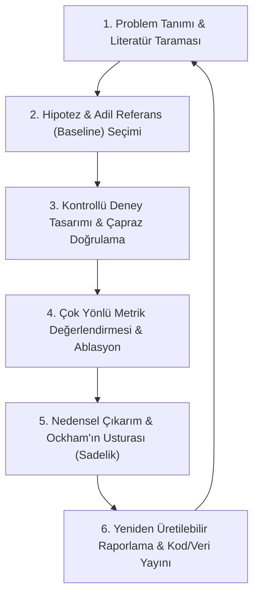

# 🔬 Bilimsel Araştırma Metodolojisi ve Sistem Değerlendirme Standartları

> *"Bilim, kesinlik arayışı değil, yanılma payımızı sistematik olarak azaltma çabasıdır. Bir sistemin başarısını kanıtlamanın yolu, onun sadece en iyi koşullarda çalıştığını göstermekten ziyade, değişken ve zorlu koşullar altındaki davranışlarını şeffafça ölçebilmektir. Doğru soruları sormayan bir araştırma, ne kadar fazla veri kullanırsa kullansın, gerçeği aydınlatamaz."*

Bu depo; yapay zeka, veri bilimi, yazılım mühendisliği ve bilgisayar bilimleri başta olmak üzere, deneysel sistemler geliştiren araştırmacılar için **deney tasarımı, performans ölçümü, mantıksal çıkarım ve kanıt sunma** süreçlerinin temel standartlarını derleyen açık kaynaklı bir rehberdir.

Amaç; yanıltıcı metriklerin ötesine geçerek, yeniden üretilebilir (reproducible), sağlam (robust) ve nedenselliği kanıtlanmış (causal) sistem değerlendirmeleri yapabilmek için gereken kavramsal çerçeveyi ve pratik uygulama araçlarını sunmaktır.

---

## 🗺️ Bilimsel Araştırma Yaşam Döngüsü

Bilgisayar bilimlerinde sağlıklı bir araştırma ve geliştirme süreci aşağıdaki döngüyü takip etmelidir:

---

## 🗂️ Depo Yapısı ve Kılavuz Bağlantıları

Aşağıdaki başlıklara tıklayarak ilgili konunun derinlemesine analizine, matematiksel formüllerine ve uygulamalı kod örneklerine ulaşabilirsiniz:

### 📊 [01. Metrikler ve Metodolojik Yanılgılar](./01_metrikler_ve_yanilgilar/)
Sınıflandırma, regresyon ve sistem performans metriklerinin hatalı kullanımını ve bunların çözümlerini ele alır.
*   📄 **[Doğruluk Paradoksu (Accuracy Paradox)](./01_metrikler_ve_yanilgilar/dogruluk_paradoksu.md)**: Sınıf dağılımının dengesiz olduğu veri kümelerinde sadece doğruluk (accuracy) metriğine güvenmenin getirdiği ölümcül hatalar ve karmaşıklık matrisi çözümü.
*   📄 **[Precision, Recall ve F1-Score](./01_metrikler_ve_yanilgilar/precision_recall_f1.md)**: Hangi durumlarda hangi metriklerin önceliklendirilmesi gerektiği, F-Beta skorları ve dengesiz verilerde ROC-AUC vs. PR-AUC seçimi.
*   📄 **[Cımbızlama Hatası (Cherry-picking)](./01_metrikler_ve_yanilgilar/cimbizlama_hatasi.md)**: Sadece en iyi sonuçları raporlayıp başarısız denemeleri gizlemenin bilimsel dürüstlüğe zararları ve çoklu seed (multi-run) raporlama standardı.

### 🧪 [02. Deney Tasarımı ve Kontrollü Kıyaslama](./02_deney_tasarimi/)
Sistemlerin ve modellerin adil, kontrollü ve istatistiksel olarak anlamlı şekilde test edilmesi standartları.
*   📄 **[Ablasyon Çalışmaları (Ablation Studies)](./02_deney_tasarimi/ablasyon_calismalari.md)**: Geliştirilen karmaşık mimarilerdeki her bir bileşenin (örn. attention, dropout, skip connections) sisteme katkısını tek tek izole ederek kanıtlama yöntemleri.
*   📄 **[Referans (Baseline) Kıyaslamaları](./02_deney_tasarimi/baseline_kiyaslamalari.md)**: Kendi yöntemimizi öne çıkarmak için zayıflatılmış veya optimize edilmemiş referans modeller kullanma hatası ve adil kıyaslama protokolü.
*   📄 **[Çapraz Doğrulama (Cross-Validation)](./02_deney_tasarimi/capraz_dogrulama.md)**: K-Fold, Tabakalı (Stratified), Zaman Serisi (Time-Series) ve Gruplanmış (Group) çapraz doğrulama stratejileri ile veri sızıntılarını (data leakage) önleme.

### 🧠 [03. Mantıksal Çıkarımlar ve Bilim Felsefesi](./03_mantiksal_cikarimlar/)
Deneysel bulguların doğru yorumlanması ve karıştırıcı etkenlerin elenmesi ilkeleri.
*   📄 **[Korelasyon vs. Nedensellik (Correlation vs. Causality)](./03_mantiksal_cikarimlar/korelasyon_vs_nedensellik.md)**: İki değişken arasındaki istatistiksel ilişkinin her zaman bir sebep-sonuç ilişkisi doğurmadığı gerçeği, karıştırıcı değişkenler (confounders) ve A/B testleri.
*   📄 **[Ockham'ın Usturası (Occam's Razor)](./03_mantiksal_cikarimlar/ockhamin_usturasi.md)**: Benzer sonuçlar veren sistemlerden en basit olanının tercih edilmesi gerekliliği, AIC/BIC metrikleri ve model açıklanabilirliği (XAI).

### 📝 [04. Makale Yazımı ve Bilimsel Raporlama](./04_makale_ve_raporlama/)
Araştırma sonuçlarının dünya standartlarında akademik dille aktarılması ve paylaşılması.
*   📄 **[Akademik Özet (Abstract) Nasıl Yazılır?](./04_makale_ve_raporlama/abstract_nasil_yazilir.md)**: Okuyucuyu ve hakemleri araştırmaya çeken, "5 Cümle Kuralı" (Bağlam, Problem, Çözüm, Sayısal Bulgular ve Katkı) çerçevesinde yapılandırılmış özet yazım rehberi.
*   📄 **[Yeniden Üretilebilirlik (Reproducibility)](./04_makale_ve_raporlama/yeniden_uretilebilirlik.md)**: Kod, veri seti ve hiperparametre paylaşım standartları, ortam izolasyonu ve deterministik rastgelelik (seed sabitleme) kuralları.

---

## 🚀 Araştırmacılar İçin Hızlı Kontrol Listesi (Cheatsheet)

Makalenizi göndermeden veya sisteminizi yayına almadan önce aşağıdaki soruları yanıtladığınızdan emin olun:

| Aşama | Kontrol Maddesi | Durum | İlgili Kılavuz |
|---|---|---|---|
| **Veri Analizi** | Sınıf dağılımlarını kontrol ettiniz mi? Dengesiz veri varsa F1-Score kullandınız mı? | [ ] | [Doğruluk Paradoksu](./01_metrikler_ve_yanilgilar/dogruluk_paradoksu.md) |
| **Model Değerlendirme** | Grafiklerde hem ROC-AUC hem de PR-AUC eğrilerini gösterdiniz mi? | [ ] | [Precision & Recall](./01_metrikler_ve_yanilgilar/precision_recall_f1.md) |
| **Raporlama Dürüstlüğü** | Sonuçlarınız tek bir şanslı çalıştırmanın (run) sonucu mu, yoksa en az 5 farklı seed ortalaması mı? | [ ] | [Cımbızlama Hatası](./01_metrikler_ve_yanilgilar/cimbizlama_hatasi.md) |
| **Mimari Doğrulama** | Önerdiğiniz modeldeki her katmanın katkısını ablasyon testleriyle gösterdiniz mi? | [ ] | [Ablasyon Çalışmaları](./02_deney_tasarimi/ablasyon_calismalari.md) |
| **Adil Kıyaslama** | Kıyasladığınız referans modellere (baselines) de kendi modeliniz kadar optimizasyon bütçesi verdiniz mi? | [ ] | [Referans Kıyaslamaları](./02_deney_tasarimi/baseline_kiyaslamalari.md) |
| **Veri Bölünmesi** | Zamana bağlı verilerde rastgele K-Fold yerine `TimeSeriesSplit` tercih ettiniz mi? | [ ] | [Çapraz Doğrulama](./02_deney_tasarimi/capraz_dogrulama.md) |
| **Yazım Düzeni** | Özet (Abstract) kısmında belirsiz ifadeler yerine net sayısal bulgulara yer verdiniz mi? | [ ] | [Abstract Yazımı](./04_makale_ve_raporlama/abstract_nasil_yazilir.md) |
| **Yeniden Üretilebilirlik** | Kodunuzu çalıştıran bir yabancının aynı sonucu alabilmesi için rastgeleliği (seed) sabitlediniz mi? | [ ] | [Yeniden Üretilebilirlik](./04_makale_ve_raporlama/yeniden_uretilebilirlik.md) |

---

## 🤝 Katkıda Bulunma

Bu kılavuz, tüm akademik topluluğun ve geliştiricilerin katkılarına açıktır. Eğer literatürde sıkça karşılaşılan yeni bir metodolojik hata, istatistiksel analiz yöntemi veya performans metriği eklemek isterseniz:

1. Bu projeyi fork edin.
2. Yeni bir `.md` dosyası oluşturun veya mevcut dosyaları geliştirin.
3. Yaptığınız değişikliği açıklayan bilimsel referanslı bir Pull Request (PR) gönderin.

## 📜 Lisans

Bu proje **MIT Lisansı** altında lisanslanmıştır. Geliştirilen kılavuzlar ve yönergeler akademik, eğitimsel ve ticari tüm çalışmalarda özgürce kullanılabilir.